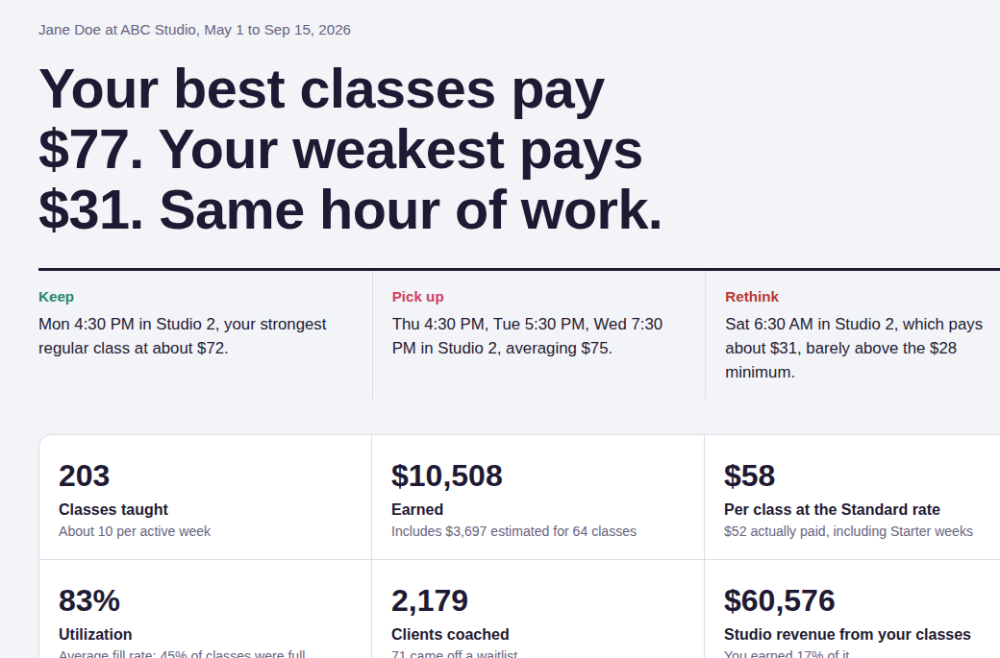
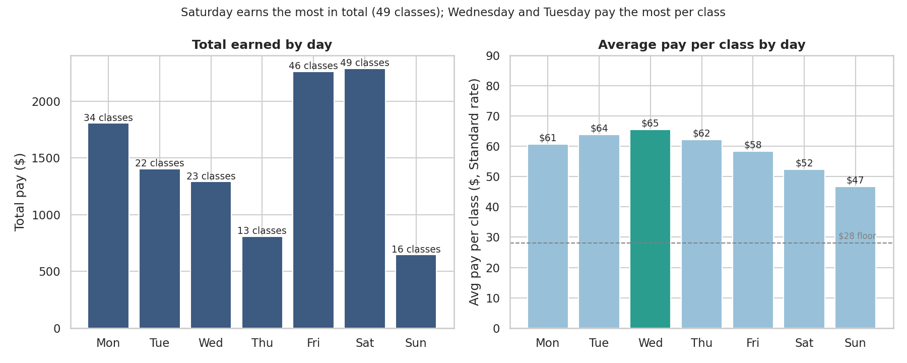
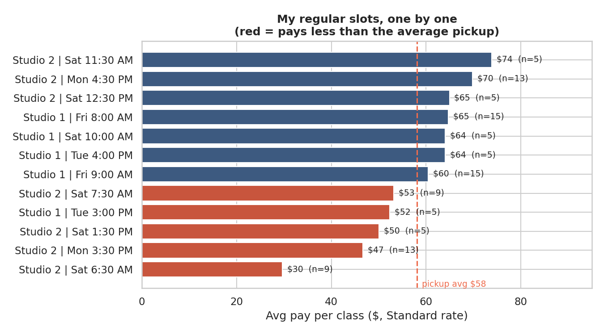
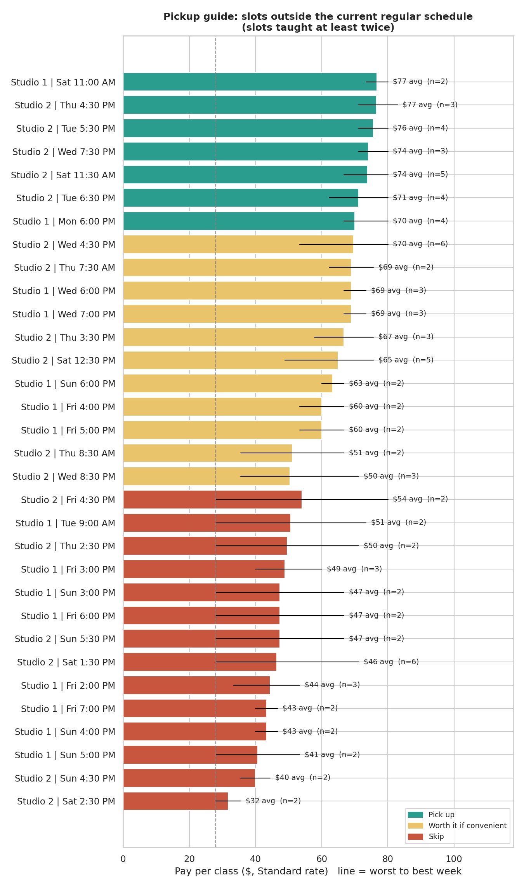

# Is This Class Worth It? A Fitness Coach Pay Analysis

A part-time fitness coach is paid per class, and pay rises with attendance, so two classes of the same length can pay very different amounts. When extra shifts open up, which ones are worth taking?

This project turns payroll exports and a hand-kept class log into a clean, anonymized dataset of **203 classes (May 1 to September 15, 2026)**. It then answers four questions:

1. Which days and times pay the most?
2. How do regular shifts compare with picked-up shifts?
3. Which classes should be picked up in the future?
4. What will the next three months pay?

**[Open the live dashboard](https://PaigeHaskins.github.io/sc-coach-pay-analysis/)**

[](https://PaigeHaskins.github.io/sc-coach-pay-analysis/)

> The data is anonymized. The coach appears as **Jane Doe** at **ABC Studio**; company names, locations, and internal file paths have been removed. Pay figures are real.

---

## Key findings

**1. The best classes pay more than twice as much as the weakest, for the same hour of work.**
Top slots average $74–77 a class. The weakest regular slot, Saturday 6:30 AM, averages $31, barely above the $28 minimum.

**2. Midweek pays the most per class; weekends pay the least.**
Wednesday ($65) and Tuesday ($64) lead. Saturday ($52) and Sunday ($47) trail, even though Saturday brings in the most in total, simply because the most classes are taught that day.



**3. Regular shifts and pickups pay the same on average ($58 per class), but the regular schedule is uneven.**
Monday 4:30 PM ($70) and Friday 8:00 AM ($65) are among the best slots of any kind. Saturday 6:30 AM ($30), Monday 3:30 PM ($47), and Tuesday 3:00 PM ($52) pay less than a typical pickup.



**4. Moving Saturdays to early morning cost about $22 per class.**
In June the regular Saturday block moved from 11:30 AM–1:30 PM to 6:30/7:30 AM. Attendance nearly halved, and half of the early classes paid only the minimum.

| Saturday block | Classes | Avg pay | Avg clients | Paid only $28 |
|---|---|---|---|---|
| Before: 11:30 AM–1:30 PM | 15 | $62.95 | 14.1 | 7% |
| After: 6:30/7:30 AM | 18 | $41.43 | 7.9 | 50% |

**5. The most valuable pickups sit right next to a regular shift.**
Weekday afternoon and evening classes in Studio 2 (Tuesday 5:30 PM, Wednesday 7:30 PM, Thursday 4:30 PM) average $74–77 and were full every time. Counting a 30-minute commute, a standalone pickup at $77 is worth about $51 an hour. One stacked next to an existing shift keeps the full $77, because no extra trip is needed.



**6. The next three months: about $9,800 at the current pace.**
The regular schedule alone is worth about $507 a week. With one week off and about 5 pickups a week (the recent pace), that's roughly $9,800 from September 16 to December 15. Trading Saturday 6:30 AM for one top pickup slot would add about $520 over the same period.

---

## The dashboard

`outputs/dashboard.html` (published as `docs/index.html` via GitHub Pages) is a single self-contained page with:

- **The verdict:** the best, weakest, and most worthwhile slots, stated up front
- **KPIs:** classes, earnings, pay per class, utilization, clients coached, and revenue generated for the studio
- **Growth over time:** weekly earnings with clients per class, plus a monthly table
- **3-month forecast:** adjustable weeks off, pickups per week, and pickup quality
- **Regular vs pickups:** side-by-side metrics and every regular slot ranked
- **"Is it worth the trip?":** pay per hour of time, including a commute you set
- **When classes pay best:** a day × time-of-day heatmap
- **The Saturday switch:** before and after

---

## How pay works

The payslips don't state the formula, so it was worked out from the data and then checked against every class:

```
Standard pay = visits × $27.80 revenue per visit × revenue share, between $28 and $83
               revenue share: 24% in Studio 1 (capacity 10), 16% in Studio 2 (capacity 16)
Starter pay  = $28 flat
```

- **Total visits include the waitlist**, so an 18-person Studio 2 class pays more than a full 16.
- The formula matches all **90 recorded Standard classes** to the cent, and all **49 Starter classes** paid exactly $28. Both checks run on every rebuild.
- **Pay type follows how each class was actually paid.** Some early classes were paid on revenue share instead of the Starter rate, so they're labeled Standard.
- Every class is also priced on the Standard formula (`pay_if_standard_rate`), so Starter weeks compare fairly with later ones. **This is not what was paid;** earnings totals always use `total_class_pay`.

---

## The data

| Source | Classes | Covers |
|---|---|---|
| Payroll exports (12 files) | 111 | May 16 – Aug 14 |
| Hand-kept class log | 92 | May 1–15 and Aug 17 – Sep 15 |

Classes from the class log have no payslip yet, so their pay is **estimated** from attendance with the Standard formula (64 classes, flagged `pay_estimated`). Checked against real payslip classes of the same studio and size, 58 of 60 estimates match to the cent; the other two differ only because of the $83 maximum. When a payslip for those classes arrives, its actual pay replaces the estimate automatically.

### Data quality issues found and fixed

| Issue | Fix |
|---|---|
| Two payroll exports were identical copies (12 rows) | Detected by file fingerprint; one copy kept |
| Revenue share was blank in May and held $28 (not a %) on Starter rows | Standard rows set to the studio's rate, Starter rows to 0%; the build stops on any unexpected rate |
| Four columns duplicated others | Dropped only after confirming they match on every row |
| Company, location, coach name, and file paths throughout | Replaced or removed; every cell is scanned for banned terms before export |
| A class log and payslips can cover the same class | The payslip wins, and the estimate is dropped |
| One cancelled class with no attendees | Kept at the $28 base pay, labeled `cancelled` |
| One payslip ($86.74) is above the stated $83 maximum | Kept as paid and flagged on every build |

### Regular vs picked up

A class is **Regular** if it matches the assigned schedule at the time, or if it's a regular shift moved for a holiday or a swap. Everything else is **Picked up**. Result: 109 regular and 94 picked-up classes.

| Day | Regular classes | Studio | Dates |
|---|---|---|---|
| Monday | 3:30 and 4:30 PM | 2 | Whole period |
| Tuesday | 3:00 and 4:00 PM | 1 | From Aug 18 |
| Friday | 8:00 and 9:00 AM | 1 | Whole period |
| Saturday | 11:30 AM, 12:30 PM, 1:30 PM | 2 | Through May 31 |
| Saturday | 6:30 and 7:30 AM | 2 | From June 1 |
| Saturday | 10:00 AM | 1 | From Aug 1 |

Exceptions (labeled Regular, with a `schedule_note`): Memorial Day and Labor Day holiday schedules, and one swapped Friday. The full list is in `src/config.py`.

---

## Pipeline

```bash
pip install -r requirements.txt
python run_pipeline.py
```

| Step | Script | What it does |
|---|---|---|
| 0 | `00_rename_files.py` | Files new payslips and class logs from `data/inbox/` under consistent names; skips anything already added |
| 1 | `01_combine.py` | Merges all payslips unchanged and prints an inventory |
| 2 | `02_clean.py` | Removes duplicates, anonymizes, fixes data types and the revenue share column |
| 2b | `02b_add_class_log.py` | Adds hand-logged classes, estimates missing pay, lets payslips replace estimates |
| 3 | `03_features.py` | Adds shift type, attendance, and Standard-rate pay; verifies the pay formula |
| 4 | `04_analysis.py` | Summary tables, charts, and pickup recommendations |
| 5 | `05_dashboard.py` | Builds the dashboard from `src/dashboard_template.html` |

Settings shared by every step (schedule, holiday exceptions, pay rules) live in **`src/config.py`**.

The anonymization check reads the words it must never find (real names, company, location) from `private_terms.txt`, one per line. That file isn't published, so the check doesn't reveal what it protects. Steps 0–2 need the private raw files; steps 3–5 run from the anonymized data in `data/processed/`.

## Adding new data

Every two weeks:

1. Put new payroll exports and/or class logs (CSV or Excel) in `data/inbox/`. File names don't matter.
2. If the regular schedule changed, or a shift was swapped or moved for a holiday, update `src/config.py`.
3. Run `python run_pipeline.py`.
4. Check the summary it prints (class count, date range, earnings, utilization), then commit and push. The live dashboard updates within a minute or two.

A class log needs four columns: `Class Date`, `Class Time`, `Studio` (1 or 2), and `Total Visits` (including the waitlist). `Total Class Pay` and `Pay Type` are optional.

---

## Project structure

```
├── run_pipeline.py        # one command to add new data and rebuild everything
├── private_terms.txt      # words the anonymization check blocks (not published)
├── src/
│   ├── config.py          # schedule, exceptions, pay rules
│   ├── 00_rename_files.py … 05_dashboard.py
│   └── dashboard_template.html
├── data/
│   ├── inbox/             # drop new files here (not published)
│   ├── raw/               # original exports and class logs (not published)
│   ├── interim/           # combined, not yet anonymized (not published)
│   └── processed/         # anonymized datasets: CSV and Excel with a data dictionary
├── outputs/
│   ├── charts/  tables/  summary.md
│   └── dashboard.html
└── docs/index.html        # the dashboard, served by GitHub Pages
```

## Limitations

- **Four and a half months of data,** mostly summer, with travel gaps (June 23 – July 7, July 23–28, August 6–10, August 15–16).
- **Estimated pay** for 64 recent classes until their payslips arrive.
- **Small samples:** several "Pick up" slots have only 2–4 classes of history.
- **Only the coach's own classes:** attendance can't yet be split between a slot's popularity and the coach's own draw. The dataset has 203 of the 213 classes on record; the other 10 are being reconciled.

## Next steps

- Keep adding payslips every two weeks to replace estimates and firm up the pickup recommendations.
- Compare attendance with other coaches in the same slots to measure the coach's own draw.
- Add a SQL version of the core analysis.
- Forecast attendance for a new slot before accepting it.

## Tools

Python (pandas, matplotlib, seaborn, openpyxl), HTML/CSS/JavaScript (dashboard), GitHub Pages
